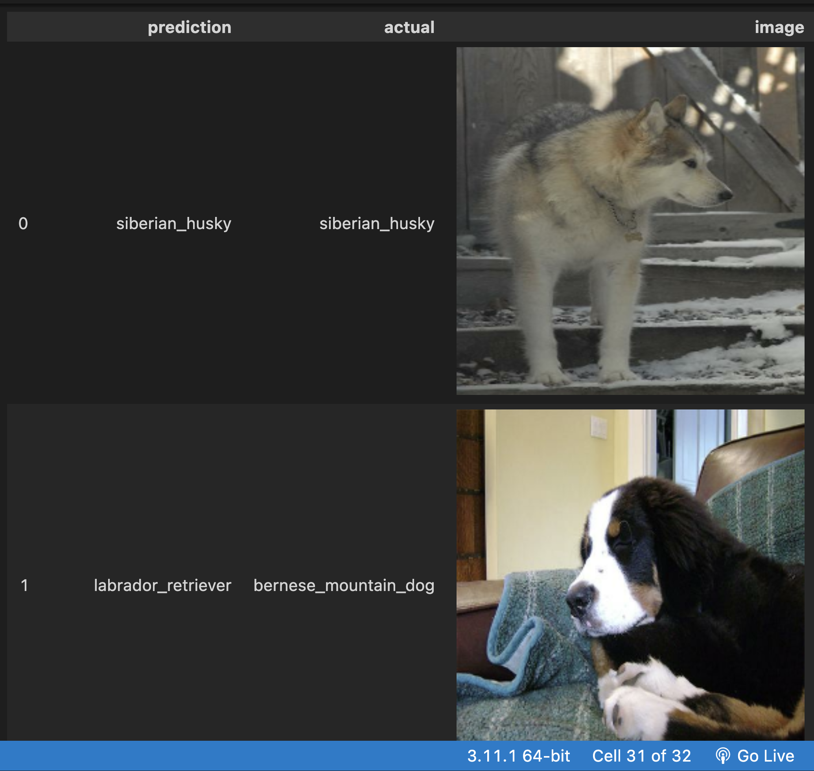

# Dog_Classification

In this project, using Tensorflow and Keras.
Read in a dataset of dog images, then train a convolutional neural network to classify them by breed.

## Result overview

## Core features

* Setting up the project (using Google Colaboratory)
* Loading in our data with tensorflow and keras
* Exploring images in our data with PIL
* Training a neural network with tensorflow and keras
* Looking at model error
* Improving our model accuracy with dropout
* Augmenting our data with keras
* Investigating model error

## Data

The data(dog_image.zip) is originally from [Stanford](http://vision.stanford.edu/aditya86/ImageNetDogs/).  The original dataset has many more breeds included, which you can use to extend your analysis.

